## Flower Classification using CNNs and Transfer Learning
This project is part of the **SE3508 - Introduction to Artifical Intelligence** midterm assignment. The goal is to develop a deep understanding of **convolutional neural networks (CNNs)**, **transfer learning**, and **feature visualization**  by implementing three models on a multi-class image classification task.   


## Topics Covered
- Multi-class image classification
- Convolutional Neural Networks (VGG16-Feature Extraction and Fine_Tuning)
- Feature Visualization ([Zeiler & Fergus, 2014)
- Model Evaluation (Accuracy, Precision, Recall, F1-Score)


## Objective 
The objective of this assignment is to:
- Build a **Custom CNN** from scratch using PyTorch.
- Apply **transfer learning** with VGG16 in two configurations:
--  As a **feature extractor** (frozen convolutional layers).
-- With **fine-tuning** (partially trainable layers).
- **Visualize learned features** in selected convolutional layers.
- **Evaluate and compare** the classification performance across all three models.

 

## Dataset 
We use the [**Flowers Dataset**] (https://www.kaggle.com/datasets/imsparsh/flowers-dataset/data)


- **Categories**: Daisy, Dandelion, Rose, Sunflower,Tulip
- **Image Format**: RGB
- **Image Characteristics**: Varying resolution, background and lighting
- **Preprocessing**:
-- Resizing all images to a fixed resolution (e.g., 224x224)
-- Normalization using ImageNet mean and std
-- Data augmentation for training (random flip, rotation, etc.)


## Models

### Model 1: Custom CNN
- Implemented from scratch using PyTorch.
- Architecture includes:
-- Multiple Conv + ReLU + MaxPool layers
-- Fully Connected layers
-- Softmax output for 5-class prediction


**Feature Visualization**:
- Visualizations from:
-- 1st Conv Layer: Edge detection
-- 3rd Conv Layer: Texture and shape features
-- 5th Conv Layer:Flower-specifichigh-level features
- Based on [Zeier & Fergus,2014] approach.


### Model 2: VGG16 as Feature Extractor
- Pretained VGG16 (ImageNet).
- All convolutional layers **frozen**.
- Classifier head **replaced** with new layers for 5-class output.
- Only the new  classifier layers are trained.

**Data Preparation**:
The data was initially split into `X` and `Y` using `train_test_split`:

```python
X_train, X_test, Y_train, Y_test = train_test_split(X, Y, random_state=0)
```

However, since this method takes up a lot of memory (especially in the Google Colab environment), the more efficient and memory-friendly **ImageDataGenerator** was used. This method also provides data augmentation:


**Note**: No visualization, since pretrained layers are not modified.


### Model 3: VGG16 with Fine-Tuning
- Pretraied VGG16 model.
- First convolutional block **frozen**(general feature extractors).
- Remaining convolutional blocks and classifier **fine-tuned**.
- Suitable for learning flower-specific patterns.


**Feature Visualization**:
- Visualizations from:
-- 1st Conv Layer: General features (edges, corners)
-- 3rd Conv Layer: Intermediate flower patterns
-- 5th Conv Layer: Complex and class-specific features


## Model Performance Comparison and Evaluation
| Model                   | Accuracy | Precision (Macro Avg) | Recall (Macro Avg) | Train Time (in s) |
|-------------------------|----------|------------------------|---------------------|--------------------|
| Custom CNN              | 1.00     | 1.00                   | 1.00                | 350                 |
| VGG16 (Feature Extractor) | 0.87     | 0.87                   | 0.87                | 1799                  |
| VGG16 (Fine-Tuned)      | 0.85     | 0.85                   | 0.85                | 21.200                  |

**Training Time and GPU Usage**
The training process for this project, specifically for VGG19 fine-tuning, may take a significant amount of time due to the absence of GPU acceleration. If a GPU is not available, the training duration will be considerably longer compared to using one. We recommend using a GPU for faster processing, especially when working with large models and datasets.(I could not use GPU for VGG16 due to hardware reasons)

When comparing the models, the **Custom CNN**, which was designed and trained from scratch, achieved an impressive 100% accuracy. This result indicates that the model fits the dataset extremely well. However, such high performance may also raise concerns about potential overfitting or high similarity between training and test samples. Nevertheless, the model clearly demonstrates strong discriminative power between classes and proves to be highly effective for the task. Given the dataset's variability in resolution and background conditions, achieving this level of accuracy with a custom-designed CNN reflects a well-chosen architecture and training strategy.

The **VGG16 feature extractor** model delivered a solid and balanced performance with 87% accuracy. The relatively consistent results across all classes suggest that the model represents the dataset well. Freezing the pretrained layers helped maintain stable and generalized performance, making this approach reliable for real-world scenarios.

On the other hand, the **VGG16 fine-tuning**  model showed slightly lower performance with 85% accuracy. This can be attributed to the fact that fine-tuning introduces more trainable parameters, potentially leading to overfitting and reduced generalization—especially on smaller and class-imbalanced datasets. Still, the model achieved acceptable accuracy and showed strong results for certain classes.

## Conclusion and Insights
The results demonstrate that the effectiveness of deep learning models depends heavily on the strategy used and the nature of the dataset. Each model has its own strengths—while the Custom CNN excels in capturing fine details, transfer learning approaches offer more stability and generalization. Therefore, model performance should not be evaluated solely on accuracy but also by considering the methodology, training setup, and dataset characteristics.
## 


## Jupyter Notebook 
All implementation details, training logs, performance metrics, visualizations etc. including:
- Model training and validation graphs
- Confusion matrices for each model
- Precision, Recall and F1 scores
- Feature visualizations from convolutional layers
are available in the **Jupyter Notebook** files.

**!!!** I strongly recommend reviewing the notebook for a full understanding step by step of the experimental process, code structureand in-depth evaluation of the models.


## Figures
## CustomCNN


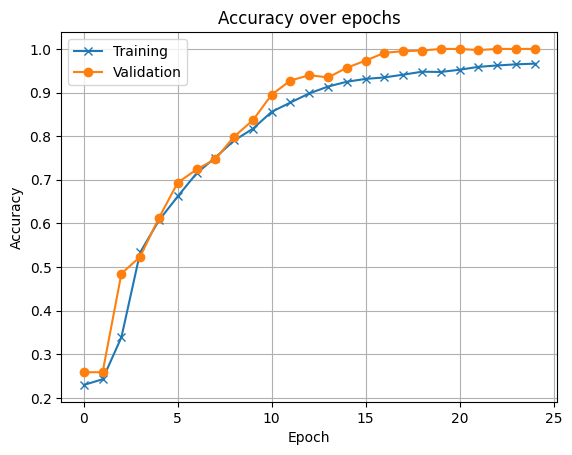
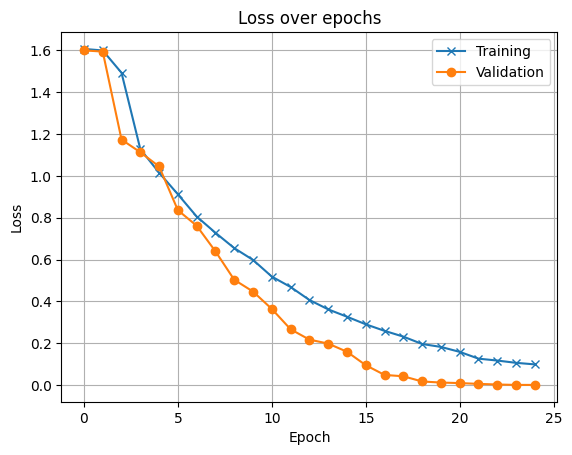
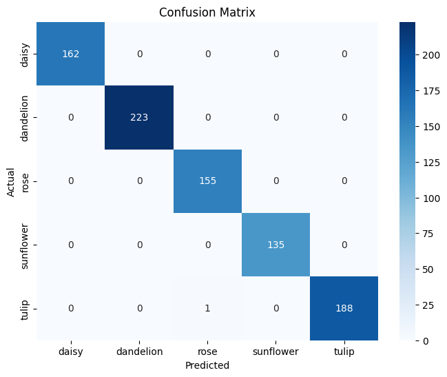
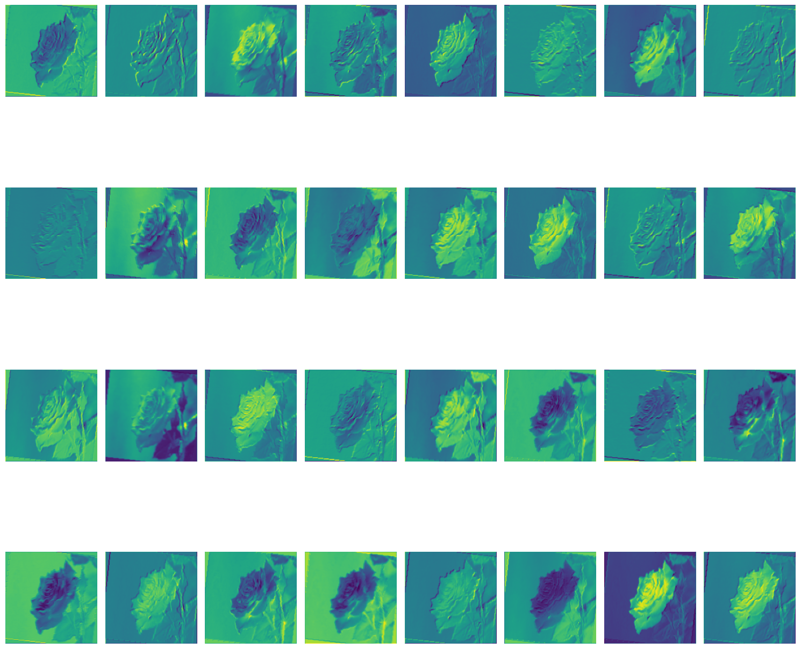
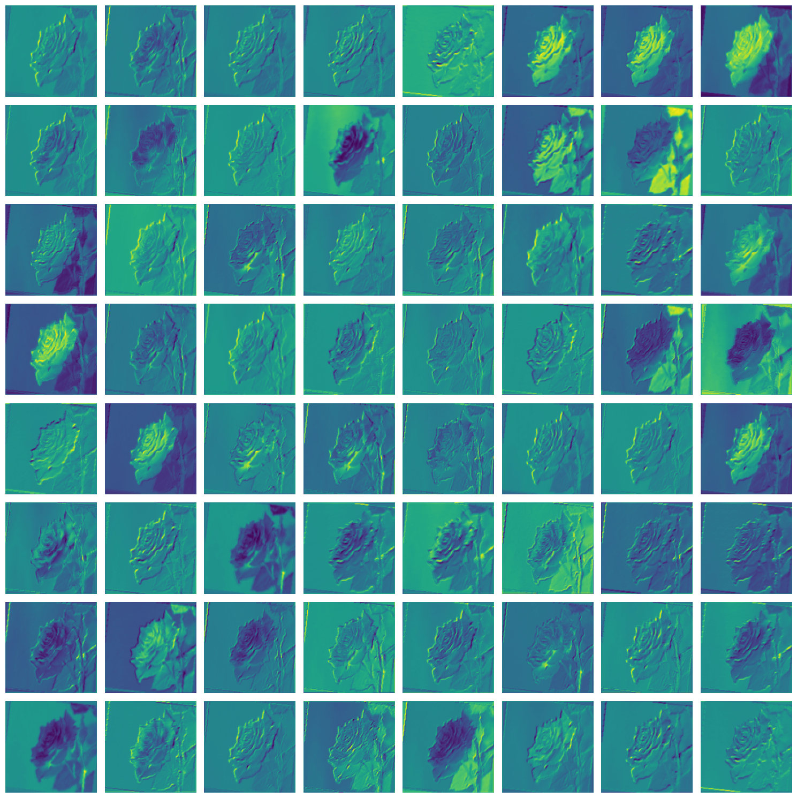
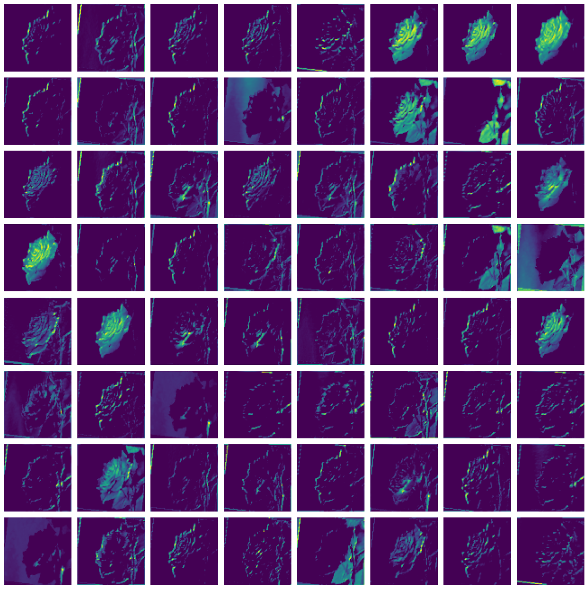


## VGG16 


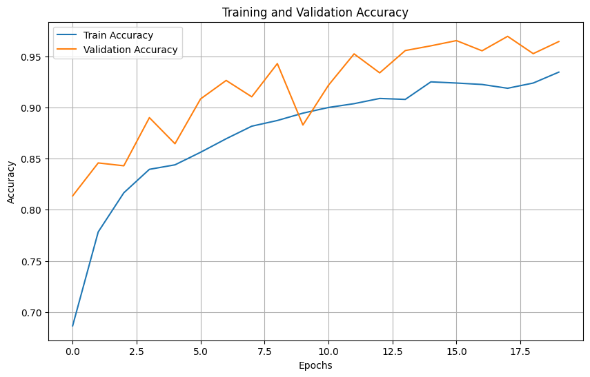
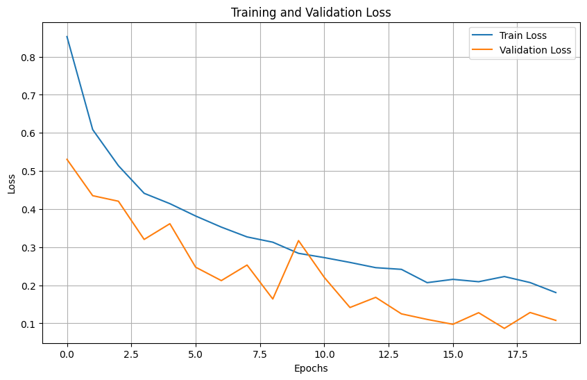
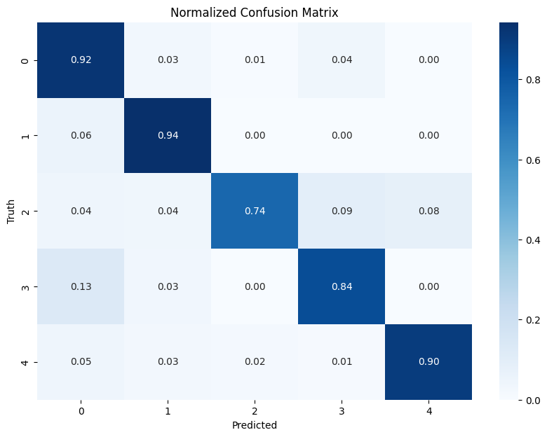


## VGG16_FineTuning


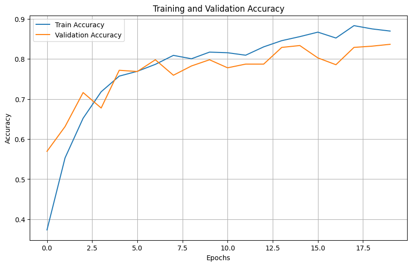
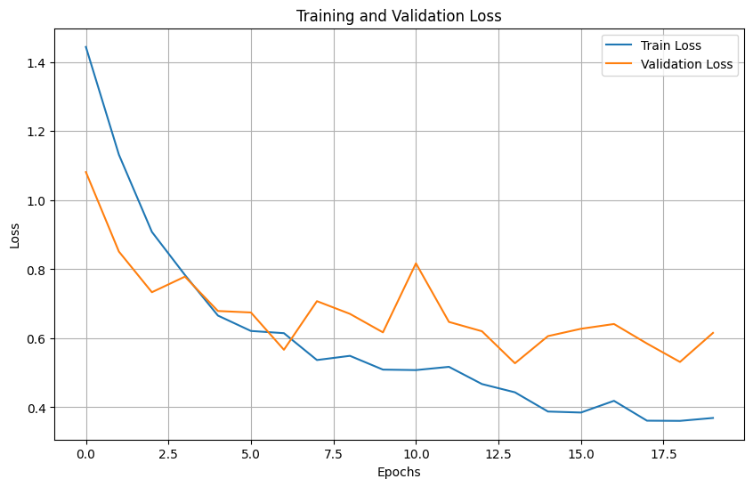
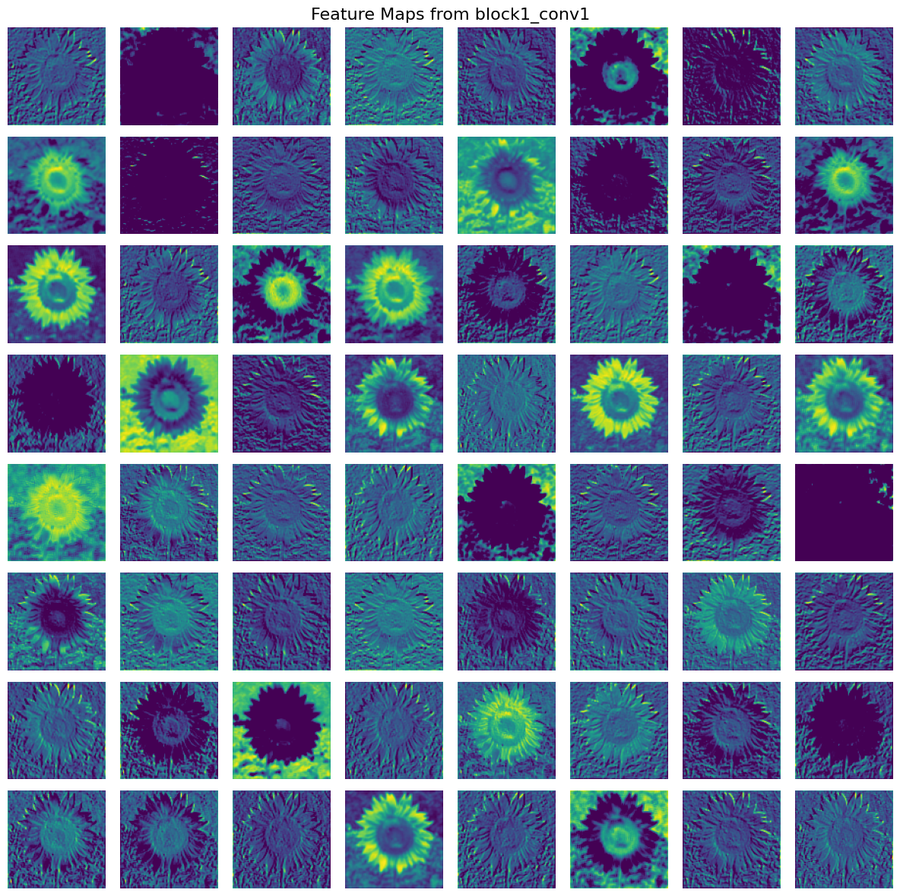
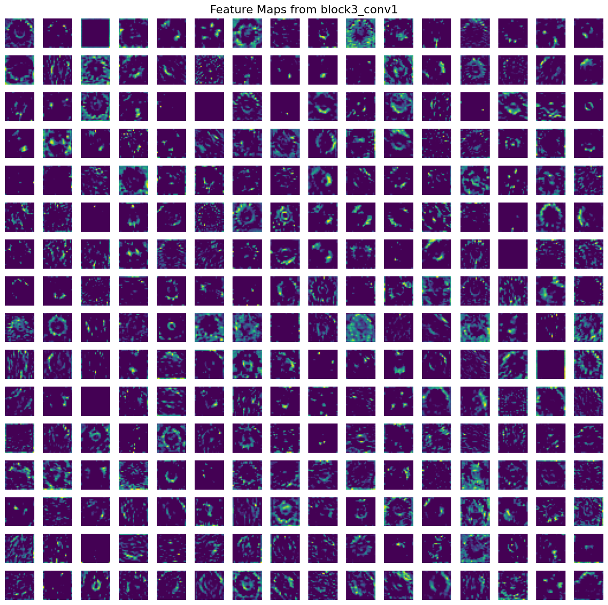
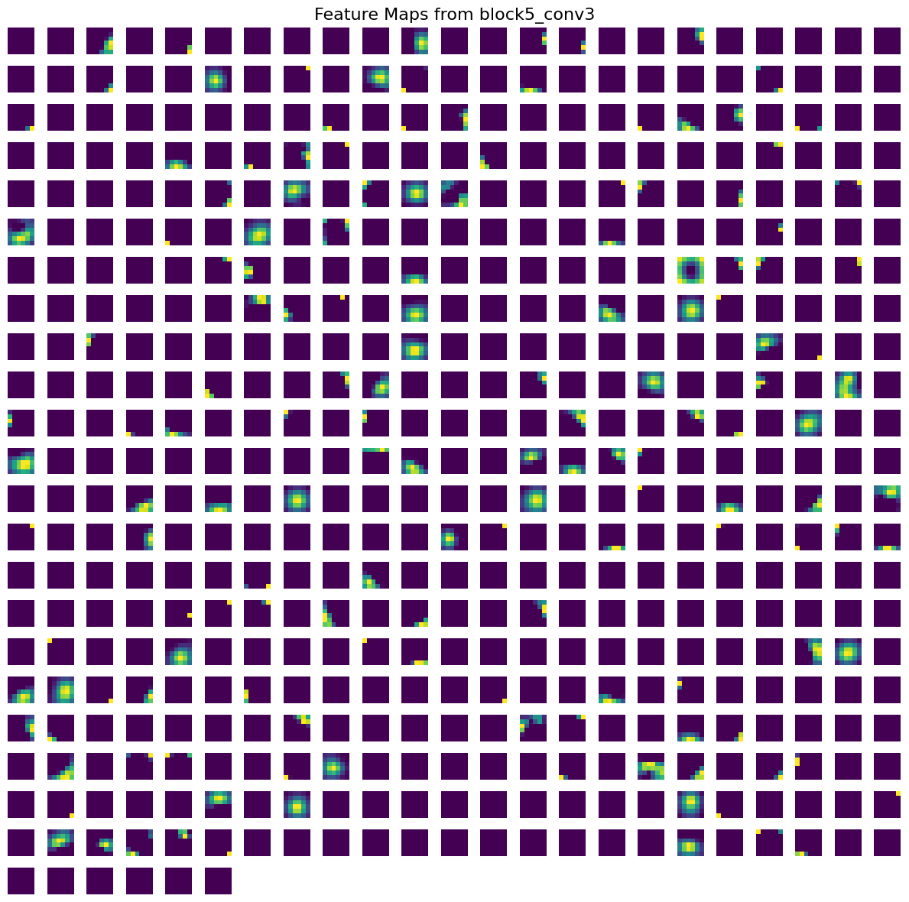


IMPORTANT:
This project was completed as part of the SE3508 Introduction to Artificial Intelligence course, instructed by Dr. Selim Yılmaz, Department of Software Engineering at Muğla Sıtkı Koçman University, 2025.

🚫 Note: This repository must not be used by students in the same faculty in future years—whether partially or fully—as their own submission. Any form of code reuse without proper modification and original contribution will be considered by the instructor a violation of academic integrity policies.

